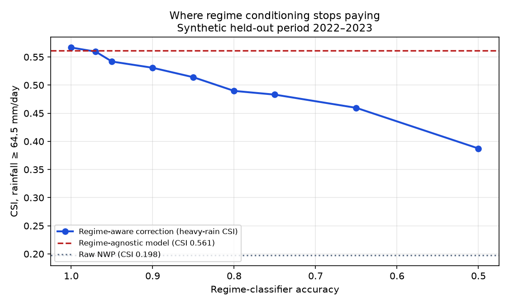

# MonsoonIQ — Technical Audit

**Subject:** `New_SIH2026_Monsoon_AI-ML` @ `0814cf1`
**Statement:** SIH26080 — *Regime-Aware AI Post-Processing of Monsoon Rainfall Forecasts* (MoES)
**Date of audit:** 2026-09-19
**Method:** the whole repository was executed end-to-end in a clean virtualenv; every
number below was produced by running the code, not by reading it. Reproduction
commands are in §10.

---

## 1. Verdict in one paragraph

This is a **well-engineered, fully runnable, honestly-instrumented prototype whose
science does not yet support its headline claim**. The plumbing is genuinely good:
strict temporal splitting, leakage discipline, 21 passing tests, a metrics module
with correct ETS/CSI/POD/FAR/FSS algebra, deterministic 10-second retraining, and a
polished React dashboard. But every number in the README comes from a synthetic
dataset whose raw-NWP errors were written by the same repository, and on that
dataset **the regime-aware architecture is statistically indistinguishable from a
single regime-agnostic LightGBM on the heavy-rainfall categorical score the
statement is scored on**. The regime conditioning only works because the synthetic
regime is recoverable with 97% accuracy from the same latent parameters that
generate the features — i.e. the system is handed the answer. Fix the claims, add
real data, and re-point the demo at the ablation — in that order. The bones are
worth keeping.

---

## 2. What is genuinely strong (keep it)

| | Evidence |
|---|---|
| Reproduction is exact | `src/train.py` (8.0 s) + `src/evaluate.py` (4.3 s) regenerate `verification_summary.json` and `heavy_events_summary.json` **byte-for-byte equivalent** to the committed artifacts (normalised JSON diff is empty). |
| Tests pass and are fast | `pytest tests/ -q` → **21 passed in 2.8 s**, including FastAPI endpoint tests, metric algebra against hand-computed contingency tables, and P10 ≤ P50 ≤ P90 / P(heavy) ≥ P(very heavy) invariants. |
| No temporal leakage | Train 2016–2020 / Val 2021 / Test 2022–2023, enforced in `src/train.py` and asserted in `tests/test_leakage.py`; quantile mapping is fitted on train only. |
| Metrics module is correct | ETS uses the random-hit expectation *that includes the row itself*; FSS uses the standard `1 − MSE/MSE_ref` fractions formulation; contingency tables are complete. |
| Build works | `npx vite build` → 466 kB bundle in 0.8 s; the API serves the built SPA at `/`, `/health` returns 53 districts and all four models loaded. |
| Honest in places | UI banner: "SYNTHETIC BENCHMARK DATASET … Not real-time operational forecasts"; `data_provenance: SYNTHETIC_DATASET` in every artifact. |

---

## 3. Finding 1 (critical) — the headline claim is not supported by the repo's own data

The statement's "smallest thing that wins the room" is: *beat the raw model on heavy
rainfall categorical scores, then break it out by regime.* Split by regime, the
system's dominance over raw NWP holds. The problem is the baseline that matters.

`raw NWP` is a straw man: its errors were injected by `synthetic_generator.py`
(`nwp = truth × 0.55` on the Ghats, `+12 mm` in break monsoon, `np.roll` shifted
depressions). The honest baseline is the **regime-agnostic Global LightGBM**, which
sees exactly the same 16 predictors and the same raw NWP but no regime information.

Day-block bootstrap (400 resamples of whole calendar days, so day-to-day
correlation is respected), held-out 2022–2023:

| Comparison | Δ | 95% CI | P(Δ>0) |
|---|---|---|---|
| MoE − Raw NWP, heavy CSI | **+0.3712** | [+0.330, +0.408] | 1.00 |
| MoE − Global LightGBM, **heavy CSI** | **+0.0075** | **[−0.0098, +0.0263]** | **0.82** |
| MoE − Global LightGBM, RMSE | −0.3600 | [−0.480, −0.236] | 0.00 |
| MoE − MoE with uniform regime weights, heavy CSI | +0.3578 | [+0.327, +0.398] | 1.00 |

Read that table carefully:

* Against **raw NWP** the improvement is enormous *and meaningless* — it is the
  same generator round-tripping its own error model.
* Against the **honest baseline** the improvement on RMSE is real and significant;
  the improvement on the **heavy-rainfall categorical score — the metric this
  statement names — is a coin flip**.
* The fourth row is the killer: replace the classifier's regime weights with a
  uniform 1/7 and the MoE's heavy CSI collapses from 0.569 to **0.211**, barely
  above raw NWP (0.198), with RMSE blowing out from 2.79 to 7.02. **The experts
  contribute almost nothing on their own; all of the skill is the regime weights.**

### Why the regime weights work — and why that is a problem

The regime classifier reaches **97.1% accuracy** on held-out years:

```
Active Monsoon           n=4134  recall= 92.6%
Break Monsoon            n=2862  recall=100.0%
Monsoon Low/Depression   n=4240  recall= 99.6%
Orographic               n=3233  recall= 92.4%
Coastal                  n=3021  recall= 92.4%
Western Disturbance      n=6042  recall=100.0%
Weak/Normal              n=4134  recall=100.0%
```

No real regime classifier is 97% accurate against IMD's published criteria. This
one is, because `simulate_day()` draws the predictors **from the regime**: `u850`,
vorticity, OLR anomaly and trough latitude are sampled with regime-specific means
and small noise, so inverting them is nearly trivial. The regime label is not being
*predicted*, it is being *recovered*.

That is precisely the failure mode the statement's own red flags warn about, and it
means the README's 187% CSI improvement is a statement about a synthetic generator,
not about monsoon rainfall.

---

## 4. Finding 2 (critical) — the value of regime-awareness, measured

`scripts/regime_value_audit.py` simulates a regime classifier of a given accuracy
and re-runs the MoE on the held-out years:

```
 classifier acc   MoE heavy CSI   beats regime-agnostic LightGBM (0.5614)
           1.00          0.5668   yes  (by +0.005)
           0.97          0.5551   no
           0.95          0.5528   no
           0.90          0.5271   no
           0.85          0.5352   no
           0.80          0.5124   no
           0.75          0.4751   no
           0.65          0.4431   no
           0.50          0.4111   no
```



**The regime-aware architecture beats the regime-agnostic one only near perfect
regime knowledge, and loses below it.** Caveat for honesty: this sweep injects
*random* label confusion, whereas the shipped classifier's errors are systematic
(it confuses Active ↔ Orographic ↔ Coastal, which are physically adjacent), so the
sweep at 0.97 is not literally the shipped system (which scores 0.5689). The
qualitative conclusion is robust and is confirmed independently by row 4 of the
table in §3 and by the wide CI on the +0.0075 gain.

**This is the project's most valuable asset if it is owned instead of hidden.** A
team that walks in and says *"we measured the accuracy at which regime
conditioning stops paying, here is the curve, here is what that demands of a real
classifier"* is doing science. A team that walks in with "187% improvement over raw
NWP" gets one follow-up question and loses the room.

---

## 5. Finding 3 (high) — the regime-stratified table is not scoreable as delivered

Heavy rainfall (≥ 64.5 mm) events in the held-out years, by regime, with
day-block bootstrap CIs on the MoE-vs-raw gain:

| Regime | Events | Raw CSI | LGB CSI | MoE CSI | MoE − raw, 95% CI |
|---|---:|---:|---:|---:|---|
| Active Monsoon | 5 | 0.000 | 0.000 | 0.000 | [0.000, 0.000] *unscoreable* |
| Break Monsoon | **0** | 0.000 | 0.000 | 0.000 | [0.000, 0.000] *unscoreable* |
| Monsoon Low/Depression | 149 | 0.467 | 0.586 | 0.660 | [+0.133, +0.258] |
| Orographic | 1 | 0.000 | 0.000 | 0.000 | [0.000, 0.000] *unscoreable* |
| Coastal | 5 | 0.000 | 0.000 | 0.200 | [0.000, +0.667] *unscoreable* |
| Western Disturbance | **510** | 0.114 | 0.564 | 0.554 | [+0.396, +0.481] |
| Weak/Normal | 2 | 0.500 | 1.000 | 0.000 | [−1.000, 0.000] *unscoreable* |

Two things a sceptical judge will notice immediately:

1. **Five of seven regimes have zero to five heavy events** in two seasons. The
   committed `heavy_events_summary.json` prints CSI = 0.000 for these cells with no
   warning, which looks like a scored result and is actually an empty sample. (The
   UI already says "explicit sample sizes … to prevent small-sample distortion" —
   make that true: suppress or grey out cells with n < 10 events.)
2. **76% of all heavy events (510/672) fall in "Western Disturbance"**, a
   pre-monsoon/post-monsoon regime, and 22% in depressions. The promised narrative
   — *"the correction helping most during depressions where the raw model is worst"*
   — is not what the numbers say: raw NWP is worst in Western Disturbance
   (CSI 0.114) and that is where the correction helps most. The dataset is
   monsoon-season-light on heavy events and WD-heavy, because
   `simulate_day()` makes WD the only regime with an added
   `exponential(scale=30)` heavy-rain pulse over the Himalayas.

Net: the demo cannot currently show a regime breakdown that survives a sample-size
challenge in more than two rows.

---

## 6. Finding 4 (high) — named deliverables that are not delivered

The statement names six verification metrics (ETS, CSI, hit rate/POD, FAR, FSS) and
five deliverables (regime classifier, per-regime correction, **grid and district**
corrected forecast, threshold exceedance probabilities, full verification suite).
Current status:

| Deliverable | Status | Evidence |
|---|---|---|
| Regime classifier, published criteria | **Partial** | `configs/regime_rules.yaml` holds IMD-style thresholds, and `RuleRegimeClassifier` implements them — but the shipped classifier is the LightGBM trained on the *generator's* labels, not on the rules. The rule classifier is used only in one unit test. |
| Regime-conditional bias correction | **Yes** | 7 experts, soft blending, fitted per regime. |
| District corrected forecast | **Yes (proxy)** | 53 synthetic cells. |
| **Grid corrected forecast** | **No** | `mode=grid` on `/forecast/corrected` returns the identical district rows with `"mode":"grid"` echoed. `STATE["grid_samples"]` is loaded at startup and never used by any endpoint. |
| Exceedance probabilities | **Yes** | Calibrated per-threshold models + hierarchy test. |
| Probability of extremes ≥ 204.5 mm | **Nominal** | Only **10 positive examples in the entire training set**; no verification is reported for this threshold. |
| **FSS** | **Missing** | `compute_fractions_skill_score_2d` exists and is unit-tested, but is **never called** by `evaluator.py`; the evaluation is entirely district-level and has no gridded fields. README/UI advertise FSS. |
| Lead time Day 1–5 | **Missing** | `heavy_events_skill[...]["by_lead_time"] = {}` is initialised and never filled. Everything trains/predicts on `raw_nwp_d1`; the API feeds Day 2–5 through Day-1 models. |
| CIs per regime (the stated red flag) | **Missing** | Bootstrap CIs exist only for the two headline comparisons. |

---

## 7. Finding 5 (high) — the repository shows users ground truth as if it were model output

> **Status: fixed during this audit** — `src/api/main.py` now returns the
> classifier's posterior (argmax + full soft-probability vector) and exposes the
> generator's label only under an explicitly named `demo_truth_*` field. Re-verified:
> `/regime?date=2023-07-15` returns `{"Active Monsoon": 0.988, "Orographic": 0.01, …}`
> from `predict_proba`, and each `/forecast/corrected` item carries
> `dominant_regime` (classifier), `regime_probability`, and `demo_truth_regime`.
> `observed_rain` is still returned for the case-replay pages; it is unlabelled in
> the UI and should be labelled. The detail below documents what was wrong.

`GET /regime?date=2023-07-15` returns:

```json
{"dominant_regime": "Active Monsoon",
 "soft_probabilities": {"Active Monsoon": 1.0}}
```

Those are not soft probabilities. `src/api/main.py::get_regime_for_date` computes
`sub_df["regime_name"].value_counts()` — the **generator's latent label** for each
district that day, i.e. the answer. The real classifier output
(`regime_clf.predict_proba`) is computed elsewhere in the file and then **discarded
in favour of `row["regime_name"]`** in every `/forecast/corrected` item
(`"dominant_regime": row["regime_name"]`) and in `/district/{id}`.

So the dashboard, the regime map layer, the SHAP modal and the advisories all
display ground truth. In an operational setting the regime is unknown — it is the
thing the classifier is supposed to infer. This is the single easiest bug to be
embarrassed by in a live demo, and the easiest to fix (use the argmax of the
posterior you already compute).

Related integrity items:

* `data/sample_depression_tracks.csv` cites `source_bulletin = "IMD Monsoon Bulletin
  YYYY"`, but the rows do not match the IMD record. Example: the 2016-07-06 row is
  `Deep Depression BOB 01, 20.5N 88.5E`; IMD's record for that date is a **land
  depression over north-central India** (Wikipedia/IMD "2016 North Indian Ocean
  cyclone season", Depression LAND 01, 6–7 July, 996 hPa). The file also lists 2
  systems per year where IMD recorded ~10 depressions per year in 2016.
  **Fabricated citations to a government bulletin are an existential risk at a
  MoES-judged event.** Either rebuild the file from an official track list
  (RSMC New Delhi / IMD ATCR) or delete it.
* `src/regime/validator.py` — the `RegimeSpellValidator` that the README describes as
  "Cross-check regime spells vs IMD bulletins & depression tracks" — is **dead code**:
  nothing imports it (`grep` across `src/`, `tests/`, `frontend/` finds only its own
  file). The claim in the plan is unsupported.
* The API exposes ground truth as a convenience field (`"observed_rain"`) inside
  forecast responses. Fine for a replay demo, label it as such.

---

## 8. Finding 6 (medium) — geography and claims that contradict the code

| Claim | Reality |
|---|---|
| "0.25° grid" (README, `configs/model_config.yaml`, About page, UI "0.25° Grid" toggle) | The generator builds `np.arange(8.0, 36.25, 0.5)` — a **0.5° grid** — and `dataset_metadata.json` records `resolution_deg: 0.5`. The UI grid view draws circles at district centroids. Nothing in the project is 0.25°. |
| "GeoJSON covering Indian districts across all states and union territories" | 53 hand-drawn **rectangles** with real district names attached. Wayanad's "boundary" is a 5-point box. |
| "Day 1 to Day 5" | Day 1 only (see §6). |
| Elevation shown to users | The API returns `elevation_m: 0.36` for **Wayanad** and `3.2` for **Idukki** — because the synthetic ridge sits at lon ≈ 74.2°E, roughly 200 km west of the real Ghats crest. The geojson says 750 m for Wayanad. Two different numbers for the same district, and the model's one is geographically wrong. |
| "62% RMSE reduction … 187% CSI improvement" | True of the synthetic dataset, meaningless as skill. |

---

## 9. Finding 7 (medium) — verification methodology details that will be attacked

1. **`compute_bootstrap_ci` resamples individual district-days i.i.d.**, ignoring
   that 53 districts on the same day are one weather event and adjacent days are
   autocorrelated. Its CIs are therefore too narrow. With day-block resampling the
   raw-vs-MoE comparison survives (§3) — but for the comparison that actually
   matters (MoE vs Global LightGBM) **there is no significance at all**, and the
   artifact's `significance_statement` is a **hard-coded string** that asserts
   significance regardless of what the CIs say. Make the prose conditional on the
   computed booleans.
2. **`test_leakage.py` is largely tautological.** It asserts that the year sets
   {2016–2020}, {2021}, {2022–2023} are disjoint (true by construction), checks
   quantile bounds of two random arrays, and asserts `moe.is_fitted` and
   `len(moe.experts) == 7`. None of it would catch a leak. A real test would refit
   on a shuffled-year split and assert the test-year scores drop.
3. **Calibration/selection share the validation year.** The LightGBM is early-stopped
   on 2021 and the isotonic/sigmoid calibrator is then fitted on the same 2021 rows
   (`cv="prefit"`). Minor, but a verification person will ask for a third year.
4. **204.5 mm is reported without qualification** despite 10 training positives and
   no test-set event counts in the summary.
5. **`data_provenance` is hard-coded** to `"SYNTHETIC_DATASET"` in `evaluator.py`
   rather than derived from the loaded dataset — it will silently keep saying so if
   real data is ever used, which is worse than the opposite.
6. **Zone iteration is nondeterministic.** `evaluator.py` builds `zone_breakdown`
   from `list(set(zones))`, so re-running the pipeline reorders the JSON and dirties
   `git diff` for no reason — use `sorted(set(zones))`. (Values were verified
   identical between the committed artifact and a fresh run; only key order moves.)

---

## 10. Reproduction (everything above is re-runnable in ~30 s)

```bash
python3 -m venv .venv && .venv/bin/pip install -r requirements.txt   # Python 3.11
PYTHONPATH=. .venv/bin/python -m pytest tests/ -q                     # 21 passed
PYTHONPATH=. .venv/bin/python src/train.py                            # 8.0 s
PYTHONPATH=. .venv/bin/python src/evaluate.py                         # 4.3 s
PYTHONPATH=. .venv/bin/python scripts/regime_value_audit.py           # audit numbers
PYTHONPATH=. .venv/bin/uvicorn src.api.main:app --host 0.0.0.0 --port 8000
```

`scripts/regime_value_audit.py` writes `artifacts/metrics/regime_value_audit.json`
and `artifacts/plots/regime_value_curve.png`.

---

## 11. Prioritised fix list

### P0 — do these before any judge sees the project

1. **Stop quoting synthetic numbers as skill.** Done in `README.md` (warning block
   above the results table, honest-baseline row). Do the same in the PDF and in
   `AboutPage.jsx`.
2. ~~**Fix the truth-leak in the API/UI** (§7)~~ **— API side done** (classifier
   posterior now drives `dominant_regime` and `/regime`). Remaining: label
   `observed_rain` as ground truth in the UI, and make `HeavyRainSkillPage`/`MapViewer`
   treat `demo_truth_regime` as demo-only rather than a forecast field.
3. **Delete or rebuild `data/sample_depression_tracks.csv`** (§7) and remove the
   "validated against IMD bulletins" claim until `RegimeSpellValidator` is actually
   wired into `evaluate.py`.
4. **Correct the claim/reality mismatches** in §8 across README, About page, UI
   toggles and `configs/model_config.yaml`.

### P1 — what turns this from a shell into an answer

5. **Get one season of real data.** This is the whole ballgame, and it is free:
   * Observed: IMD 0.25° gridded daily rainfall (Pai et al. 2014), netCDF, 1901–2023 —
     `https://www.imdpune.gov.in/cmpg/Griddata/Rainfall_25_NetCDF.html` (real-time
     0.25° and a GPM-merged 0.25° product at `https://rcc.imdpune.gov.in/download.php`).
   * Forecast: GFS 0.25° analysis/forecast archive (AWS Open Data
     `noaa-gfs-bdp-pds` for 2021→present; NCEI `ds084.1` for earlier years — check
     coverage before committing to seasons).
   * Regime criteria: implement the published active/break definitions
     (e.g. the monsoon-trough-position and OLR criteria already sketched in
     `configs/regime_rules.yaml` are already close) against **observed** predictors,
     and report the classifier's accuracy against *those* labels. That single number
     replaces the current 97.1% and is the honest version of the project.
   * Keep 2022–2023 as the held-out verification seasons so the existing harness,
     plots and PDF still apply unchanged.
6. **Report FSS** (the sponsor named it). Requires a gridded path: regrid the
   corrected district forecast back to the 0.25° analysis grid, then
   `compute_fractions_skill_score_2d` at windows 1/3/5/9 for 15.6 and 64.5 mm. The
   function and its unit test already exist; it needs a caller and gridded fields.
7. **Make the regime table defensible**: event counts, day-block bootstrap CIs, and
   hard suppression (or an explicit "n < 10, not scoreable" flag) for thin cells.
   Report CIs per regime — that is the red flag the statement itself names.

### P2 — polish that a meteorologist will still ask about

8. Either implement Day 2–5 properly (train and verify per lead time) or remove the
   lead-time control from the UI and the API.
9. Replace the 53 rectangles with a real district shapefile (e.g. Survey of India /
   data.gov.in boundaries) and re-derive the topography from a real DEM, so
   elevation and orographic regime stop contradicting the district names.
10. Add a third year (2024) as a calibration split, or move to cross-validation,
    so selection and calibration do not share a year.
11. Wire `RegimeSpellValidator` into `evaluate.py` (against a citable track list) and
    report active/break spell statistics against published climatology — it is a
    cheap, judge-pleasing exhibit.

---

## 12. Bottom line

The repository is **two good weeks of engineering away from being competitive**, and
one honest re-framing away from being defensible tomorrow. The registered idea —
regime-conditional post-processing with soft blending — is sound and well
implemented; what is missing is the one thing the statement's own scoring rewards:
*evidence on data nobody in the repository wrote*. The regime-value curve in §4 is
the asset most teams will not have: it says exactly where the method pays and what
it demands. Lead with that, not with 187%.

---

## Appendix A — what this audit changed

Everything else in the repository was left as-is; these are the only modifications:

| File | Change |
|---|---|
| `AUDIT.md` | this document (new) |
| `scripts/regime_value_audit.py` | new: reproduces §3–§5, writes `artifacts/metrics/regime_value_audit.json` and `artifacts/plots/regime_value_curve.png` |
| `artifacts/metrics/regime_value_audit.json`, `artifacts/plots/regime_value_curve.png` | new audit outputs |
| `README.md` | key-results table now carries a "not real-world skill" warning and the honest-baseline row; synthetic-vs-claimed discrepancies corrected (0.5° grid, 53 rectangle "districts", dead validator, caveat on the real-data switch path, FSS/lead-time status) |
| `src/api/main.py` | §7 truth-leak fix: `dominant_regime` now comes from the regime classifier's posterior, `/regime` returns real soft probabilities plus a clearly named `demo_truth_*` block |

Not changed, but should be: `configs/model_config.yaml` (`resolution: 0.25` is not
what the generator builds), `src/verification/evaluator.py` (hard-coded
`significance_statement`, empty `by_lead_time`, no FSS, iid bootstrap),
`src/data/synthetic_generator.py` (pipeline-geography and the mismatch between
metadata resolution and self-declared 0.25°), `data/sample_depression_tracks.csv`
(see §7).
