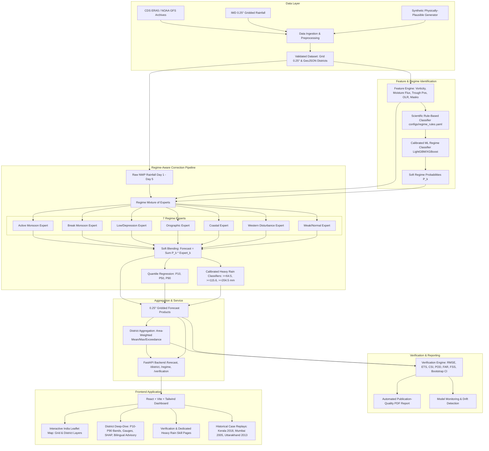

# Implementation Plan - MonsoonIQ: Regime-Aware AI Post-Processing System for Monsoon Rainfall Forecasts over India

MonsoonIQ is an operational, regime-aware AI post-processing system designed to eliminate systematic NWP (Numerical Weather Prediction) forecast errors across India's diverse meteorology. By identifying prevailing weather regimes (Active Monsoon, Break Monsoon, Monsoon Low/Depression, Orographic, Coastal, Western Disturbance, Weak/Normal) and routing predictions through a specialized Mixture-of-Experts (MoE) architecture, MonsoonIQ delivers calibrated, high-skill grid (0.25°) and district-level rainfall forecasts, extreme weather probabilities, interactive spatial dashboards, and automated verification reports.

## User Review Required

> [!IMPORTANT]
> **Data Strategy & Default Mode**: The system provides a complete **REAL mode** adapter and downloaders (IMD 0.25° gridded rainfall, NOAA GFS archives, CDS ERA5 predictors, with validation, resumption, and alignment scripts) alongside a seeded, physically plausible **SYNTHETIC mode** covering 8 years across India (lat 6°–38°N, lon 68°–98°E, JJAS + transition windows). The system runs out-of-the-box in **SYNTHETIC mode** to allow immediate testing, evaluation, and interactive exploration, with all UI badges, API endpoints, and PDF reports explicitly and transparently indicating data provenance.

> [!NOTE]
> **Environment & Dependencies**: Python 3.11 with scikit-learn 1.4.2, LightGBM, XGBoost, FastAPI, Xarray, ReportLab, and Node.js v24 with Vite/Tailwind have been validated in the workspace virtual environment.

---

## Proposed System Architecture



---

## Proposed Implementation Tasks

### 1. Configuration & Scientific Regime Definitions
- `configs/regime_rules.yaml`: Define meteorologically backed thresholds for:
  - **Active Monsoon**: Strong 850 hPa LLJ (>15 m/s), high positive cyclonic vorticity (>2.5e-5 s⁻¹), negative OLR anomalies (< -20 W/m²), monsoon trough in normal/south position.
  - **Break Monsoon**: LLJ weakens or shifts south; monsoon trough moves to Himalayan foothills; positive OLR anomaly over central India (> +15 W/m²); dry spell over core monsoon zone.
  - **Monsoon Low/Depression**: Intense closed cyclonic vorticity center (>5.0e-5 s⁻¹), deep MSLP minimum (< 996 hPa), intense moisture convergence.
  - **Orographic**: Strong westerly winds impinging on Western Ghats crest (terrain slope > 0.02, elev > 500m) or southern Himalayan slopes.
  - **Coastal**: Convergence zone within 50 km of coastline, marine-to-terrestrial moisture boundary.
  - **Western Disturbance**: Mid-latitude 500 hPa trough with high geopotential vorticity anomaly over NW India (lat > 26°N, lon < 80°E), prevalent in pre-monsoon/transition/winter.
  - **Weak/Normal**: Transitional or baseline convective state.
- `configs/model_config.yaml`: Strict time split (Train: 2016-2020, Val: 2021, Test: 2022-2023), learning rates, quantile alphas (0.1, 0.5, 0.9), LightGBM/XGBoost parameters.
- `configs/verification_config.yaml`: Standard IMD thresholds (2.5 mm, 15.6 mm, 64.5 mm, 115.6 mm, 204.5 mm), FSS neighborhood window scales ($1\times 1, 3\times 3, 5\times 5, 9\times 9$).

### 2. Data Module & Geographic Support
- `src/data/synthetic_generator.py`: Generate an 8-year daily, meteorologically realistic dataset over India ($6^\circ - 38^\circ\text{N}, 68^\circ - 98^\circ\text{E}$ at $0.25^\circ$ resolution, $\sim 200$ days/year covering JJAS + transition windows):
  - Topography & land-sea masks (Western Ghats, Himalayas, Deccan Plateau, coastal strips).
  - Atmospheric predictors: $U_{850}, V_{850}$, vorticity, MSLP, $q_{500}$, CAPE, OLR, moisture flux $\vec{v} \cdot q$.
  - Raw NWP forecasts with known structural biases:
    - Orographic dry bias on Western Ghats windward slopes.
    - Break monsoon wet bias over central India.
    - Spatial position displacement on depressions ($100-200\text{ km}$).
    - Coastal convergence underestimation.
    - Over-smoothing and missed extremes on WD events in northern India.
- `src/data/downloader.py`: Production-grade download scripts for NOAA GFS NOMADS/AWS archive, CDS ERA5 Copernicus API, and IMD portal adapters with chunking, retry, resume, and credential management.
- `src/data/validator.py`: Comprehensive validation checking coordinate alignment ($0.25^\circ$), NaN thresholds, unit standardizations ($\text{mm/day}, \text{m/s}, \text{J/kg}, \text{hPa}$), and date continuity.
- `src/data/geo_utils.py`: High-performance spatial raster-to-polygon area-weighted aggregation engine for Indian districts.
- `data/geojson/india_districts.geojson`: Pre-bundled, standardized GeoJSON covering Indian districts across all states and union territories.
- `data/sample_depression_tracks.csv`: Sample real/historical depression and cyclonic disturbance tracks for validation.

### 3. Regime Identification & Explainability
- `src/regime/rule_classifier.py`: Ground-truth rule classifier that assigns the dominant physical regime and soft rule scores to each grid cell/day based on meteorological thresholds.
- `src/regime/validator.py`: Cross-check tool comparing rule-derived active/break spells and depression dates against IMD monsoon bulletins / depression tracks CSV, generating accuracy and agreement metrics.
- `src/regime/ml_classifier.py`: Multi-class LightGBM / XGBoost classifier trained on atmospheric predictors to predict soft regime probabilities $P(R_k)$ with Platt/isotonic probability calibration.
- Tree-based SHAP feature attribution generation for local and global regime explainability.

### 4. Mixture-of-Experts Bias Correction & Heavy-Rain Module
- `src/correction/quantile_mapping.py`: Robust empirical quantile mapping (EQM) fitted strictly on training data (preventing test leakage).
- `src/correction/residual_expert.py`: Regime-specific LightGBM residual learning models ($\Delta Y = Y_{obs} - Y_{QM}$).
- `src/correction/mixture_of_experts.py`: Soft-blending Mixture of Experts:
  $$\hat{Y}_{MoE} = \sum_{k=1}^7 P(R_k) \cdot \hat{Y}_{\text{Expert}_k}$$
- `src/correction/quantile_regressor.py`: LightGBM quantile regression models estimating P10, P50 (median), and P90 rainfall bounds.
- `src/heavy_rain/heavy_rain_classifier.py`: Calibrated binary classifiers for IMD thresholds:
  - Heavy Rain: $\ge 64.5\text{ mm/day}$
  - Very Heavy Rain: $\ge 115.6\text{ mm/day}$
  - Extremely Heavy Rain: $\ge 204.5\text{ mm/day}$
  Using `scale_pos_weight`, isotonic probability calibration, and optimization for POD and CSI without exploding FAR.
- Comparison against all 3 required baselines:
  1. Raw NWP
  2. Single Global Quantile Mapping
  3. Single Global LightGBM (regime-agnostic)

### 5. District Aggregation & Advisory Generation
- Area-weighted grid-to-district projection for:
  - Corrected mean and max forecast (mm/day)
  - P10, P50, P90 confidence bounds
  - Exceedance probabilities for $64.5, 115.6, 204.5\text{ mm}$
  - Fractional district area exceeding each alert threshold
- District alert categorization: Green (No warning), Yellow (Watch - Heavy rain likely), Orange (Alert - Very heavy rain likely), Red (Warning - Extremely heavy rain / widespread severe downpours).
- `src/api/advisory.py`: Rule-based bilingual plain-language meteorological advisories (English & Hindi) for farmers and disaster managers, plus CAP-style (Common Alerting Protocol) JSON alerting.

### 6. Comprehensive Verification Module & ReportLab PDF
- `src/verification/metrics.py`: Rigorous calculation of:
  - Continuous: RMSE, Mean Absolute Error (MAE), Mean Bias
  - Dichotomous Contingency Metrics: Probability of Detection (POD), False Alarm Ratio (FAR), Critical Success Index (CSI / Threat Score), Frequency Bias (FBIAS), Equitable Threat Score (ETS / Gilbert Skill Score), Brier Score
  - Spatial: Fractions Skill Score (FSS) at neighborhood windows ($1, 3, 5, 9$ cells)
  - Probabilistic: ROC Curve & AUC, Reliability Curve with sharpness histograms
- `src/verification/evaluator.py`: Stratified evaluation:
  - Overall skill (Grid & District)
  - Skill by regime (Active, Break, Low/Depression, Orographic, Coastal, WD, Weak)
  - Skill vs lead time (Day 1 through Day 5)
  - Dedicated "Heavy and Very Heavy Rainfall Skill" section reported separately with explicit event counts
  - Bootstrap 95% confidence intervals and statistical significance tests
- `src/verification/report_generator.py`: Production-ready PDF report generator using ReportLab with:
  - Executive summary & performance scorecards
  - High-resolution embedded matplotlib vector charts (Reliability diagrams, ROC curves, FSS curves, lead-time degradation)
  - Raw NWP vs Global QM vs Global LightGBM vs MonsoonIQ baseline comparison tables
  - Clear data provenance badge ("SYNTHETIC DATASET" or "REAL IMD/GFS DATASET") and honest limitations section.

### 7. FastAPI Backend
- Preload trained models and cached outputs at server startup for instantaneous sub-100ms response.
- Endpoints:
  - `GET /health`: System health & model status
  - `GET /regime`: Spatial regime probabilities & dominant regime map
  - `GET /forecast/corrected`: Corrected forecast (grid and district modes, Day 1–5, P10/P50/P90)
  - `GET /forecast/heavy-probability`: Grid and district heavy rain probabilities (64.5, 115.6, 204.5 mm)
  - `GET /district/{id}`: Detailed district forecast, P10-P90 band, regime breakdown, bilingual advisory, CAP alert
  - `GET /districts`: District list, search index, and metadata
  - `GET /districts/geojson`: Bundled district boundary GeoJSON
  - `GET /verification/summary`: Full baseline comparison metrics (Grid & District)
  - `GET /verification/heavy-events`: Dedicated heavy/very heavy skill breakdown with event counts
  - `GET /verification/report.pdf`: Binary download of auto-generated verification report
  - `GET /explain/{district}/{date}`: SHAP feature attributions for regime and rainfall correction
  - `GET /case-replays`: Pre-configured historical extreme events (Kerala 2018, Mumbai 2005, Uttarakhand 2013) with multi-day temporal steps

### 8. Modern Frontend (React + Vite + Tailwind CSS)
- Modern, accessible, responsive design with Dark/Light mode support.
- **Header & Navigation**: Brand banner with data provenance badge, regime status indicator, date selector, lead time slider (Day 1 to 5), and navigation tabs.
- **Dashboard (Main View)**:
  - Interactive Leaflet map of India with layer switchers: Raw NWP, MonsoonIQ Corrected, Difference/Bias Correction, Heavy Rain Probability ($\ge 64.5$ mm), Very Heavy Probability ($\ge 115.6$ mm), Regime Map.
  - View toggle: High-resolution Grid ($0.25^\circ$) vs District Polygon mode.
  - Interactive click-to-select district loading side panel.
  - Color-coded IMD alert legend and summary statistics.
- **District Detail Panel & Searchable Table**:
  - P10/P50/P90 prediction interval visualizer.
  - Gauge cards for Heavy, Very Heavy, and Extremely Heavy probabilities.
  - Regime soft probability horizontal bar chart.
  - Plain-language advisory in English and Hindi for disaster response teams.
  - SHAP explanation drawer explaining *why* the forecast was adjusted.
  - Sortable/searchable district table with CSV and GeoJSON export.
- **Verification Page**:
  - Raw NWP vs Global QM vs Global LightGBM vs MonsoonIQ comparison scorecard.
  - Interactive charts: Reliability Diagram, ROC curve, Performance Diagram, FSS vs Neighborhood scale, Skill degradation vs Lead Time.
  - One-click "Download Official Verification Report (PDF)" button.
- **Heavy and Very Heavy Rainfall Skill Page**:
  - Dedicated focus on rare extremes ($64.5$ and $115.6$ mm/day).
  - POD, FAR, CSI, ETS, FSS stratified by weather regime and lead time, with explicit event sample counts.
- **Historical Case Replay Page**:
  - Pre-configured extreme weather events:
    1. **Kerala August 2018** (Extreme orographic + low-level jet synoptic surge)
    2. **Mumbai July 2005** (Mesoscale coastal convergence downpour)
    3. **Uttarakhand June 2013** (Western Disturbance interacting with early monsoon trough)
  - Time scrubber slider and side-by-side comparative maps (Raw NWP vs MonsoonIQ vs Observed Truth).
- **Model Monitor Page**:
  - Rolling verification metrics, data drift alerts, feature distribution shifts.
- **About & Methodology Page**:
  - Transparent documentation of the regime-aware mixture of experts, rule labeling rationale, data provenance, and scientific limitations.

### 9. Test Suite & Verification
- `tests/test_leakage.py`: Strict temporal split verification test ensuring test period data never leaks into training, quantile mapping, or scalers.
- `tests/test_metrics.py`: Exact unit tests for all contingency metrics (POD, FAR, CSI, ETS, FSS, RMSE) against hand-calculated analytical matrices.
- `tests/test_pipeline.py`: End-to-end pipeline shape tests, regime classifier output checks, MoE blending conservation, quantile regression monotonicity ($P10 \le P50 \le P90$).
- `tests/test_api.py`: FastAPI test client testing all HTTP endpoints, schemas, headers, and PDF binary responses.

### 10. Packaging & Documentation
- Scripts: PowerShell (`scripts/setup.ps1`, `scripts/data.ps1`, `scripts/train.ps1`, `scripts/evaluate.ps1`, `scripts/api.ps1`, `scripts/ui.ps1`, `scripts/all.ps1`) and Makefile equivalents.
- `requirements.txt`, `package.json`, `Dockerfile`, `docker-compose.yml`.
- `README.md` with Mermaid diagram, setup instructions, real vs synthetic guide, results table, screenshot placeholders, and limitations/caveats section.

---

## Verification Plan

### Automated Tests
1. Run pytest across all test suites:
   ```powershell
   .venv\Scripts\pytest tests/ -v
   ```
2. Verify all metrics, leakage checks, pipeline shapes, and API endpoints succeed.

### End-to-End Pipeline Execution
1. Run dataset generation:
   ```powershell
   .venv\Scripts\python src/data/synthetic_generator.py
   ```
2. Train regime classifier, MoE experts, quantile regressors, and heavy-rain classifiers:
   ```powershell
   .venv\Scripts\python src/train.py
   ```
3. Run comprehensive verification and generate static artifacts and PDF:
   ```powershell
   .venv\Scripts\python src/evaluate.py
   ```
4. Verify backend runs and serves valid JSON and PDF binary:
   ```powershell
   .venv\Scripts\uvicorn src.api.main:app --port 8000
   ```
5. Build and verify frontend:
   ```powershell
   cd frontend
   npm.cmd run build
   ```
