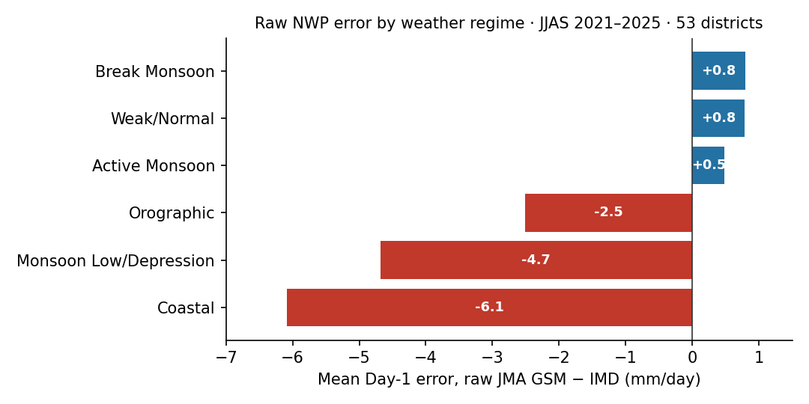
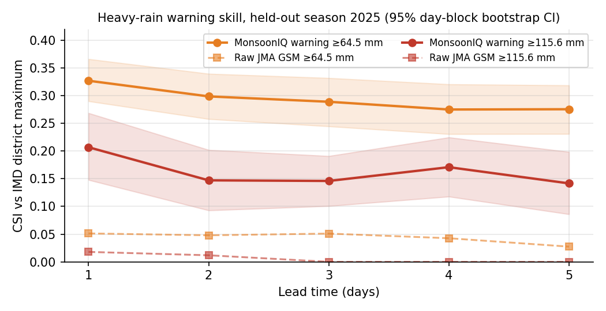
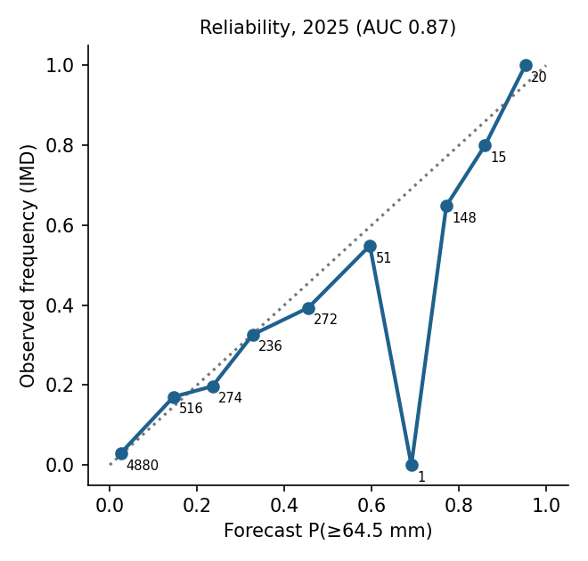

# MonsoonIQ on real data: datasets, processing, and results

*Built 25 September 2026 from official and archived sources. Every number on this page can be
reproduced with `python scripts/fetch_real_data.py all` followed by `MONSOONIQ_PROFILE=real make real`.
The archive's own record of what was built is `data/real/dataset_metadata.json`.*

---

## 0. The dataset in one table

| Quantity | Value |
|---|---|
| Seasons | JJAS 2021, 2022, 2023, 2024, 2025 (610 days) |
| Districts | 53 study districts, on Census-2011 polygons |
| District-days with both observation and forecast | **32,065** |
| Split (by season, never shuffled) | train 2021–2023 (19,239) · validation 2024 (6,413) · **test 2025 (6,413; 121 days)** |
| Observed truth | IMD 0.25° gridded daily rainfall |
| Raw forecast | JMA GSM, Day 1–5, archived runs (Open-Meteo Previous Runs) |
| Regime predictors | GFS analysis at 00 UTC on D−1 (Open-Meteo Historical Forecast) |
| Terrain | Copernicus GLO-90 DEM |
| Missing predictor values | 0.17 % (filled with the training-season median) |

---

## 1. IMD 0.25° gridded daily rainfall (the truth)

**What it is.** IMD Pune's gauge-based analysis of daily rainfall over India. About 6,900 rain
gauges are interpolated onto a 0.25° × 0.25° grid, 129 × 135 cells covering 6.5–38.5 °N and
66.5–100 °E (Pai et al. 2014, *Mausam* 65:1–18). IMD itself verifies rainfall forecasts against
this analysis, and the IMD warning thresholds (64.5, 115.6 and 204.5 mm) are defined on rainfall
of this kind.

**How we got it.** From `imdpune.gov.in/cmpg/Griddata/rainfall.php`, one file per year, with no
login (`src/data/real/imd.py`). Each file was checked against the exact size the format implies:
365 days × 129 × 135 × 4 bytes = 25,425,900 bytes, and 25,495,560 bytes for the leap year 2024.
All five files matched.

**How we processed it.**

1. **Read the binary.** Little-endian float32 in (day, latitude, longitude) order. −999 means no
   data (sea, or cells outside India) and becomes NaN.
2. **Aggregate grid cells to districts.** Each cell is weighted by how much of it falls inside
   the Census-2011 district polygon, estimated with 5 × 5 sample points per cell.
3. **Compute three numbers per district-day:**
   * **`obs_rain_mean`** — the area-weighted mean. The corrected forecast is trained on this.
   * **`obs_rain_max`** — the heaviest cell that is at least 25 % inside the district. IMD
     heavy-rain warnings are about the heaviest rain anywhere in a district, so heavy-rain skill
     is scored against this.
   * **`obs_rain_p90`** — the 90th percentile across the district's cells.
4. **Small coastal districts.** Chennai's polygon only overlaps cells that IMD leaves empty over
   the sea. It is given its two nearest land cells instead. This is logged; before the fix,
   Chennai silently dropped out.
5. **Core-monsoon-zone rainfall.** The daily area-mean over the core monsoon zone of Rajeevan et
   al. (2010) is computed from the same grid. It feeds the active/break regime labels (§5).

**Sanity check.** The largest district value in the archive is 891 mm, in East Khasi Hills
(Cherrapunji) on 17 June 2022. That is the day Cherrapunji recorded one of its wettest June days
on record, so the extremes in the data are real events.

**Why it matters for the project.** It turns every skill number into a genuine comparison with
what fell on the ground. It also defines the target that each module learns: the district mean
for the corrected amount, and the district maximum for the warnings.

---

## 2. IMD day convention: a one-day misalignment the data exposed

IMD labels a day's rain by the 0830 IST (03 UTC) reading that **ends** the 24-hour period, so
"25 July" means rain from 03 UTC on 24 July to 03 UTC on 25 July. The first build assumed the
opposite. The pipeline has a built-in check: it correlates observed rain with the Day-1 forecast
at shifts of −1, 0 and +1 day, and it flagged the problem.

| Alignment | corr(IMD, Day-1 forecast) |
|---|---|
| Forecast window starting on the labelled day (first attempt) | 0.48 |
| **Window ending on the labelled day (IMD convention, now used)** | **0.58** |
| One day the other way | 0.45 |

Forecast totals and the "label" dynamics are now shifted by one day (`day_offset: 1` in
`configs/data_sources.yaml`). The check re-runs on every build; its latest result is under
`day_alignment_check` in the metadata.

**Why this matters.** A one-day offset makes every forecast look worse than it is, and teaches a
post-processor to fix a timing error rather than a model error. Many post-processing studies
never check this.

---

## 3. Raw NWP forecasts: JMA GSM Day 1–5 (archived runs)

**What it is.** What an operational global model actually predicted N days before each valid
time, from the Open-Meteo Previous Runs API. For every hour, the value for Day N comes from the
run started at least 24·N hours earlier, so this is a genuine forecast with no hindcast leakage.
The licence is CC BY 4.0.

**Why JMA GSM.** `scripts/probe_forecast_archive.py` tested seven models, asking for Day-1 and
Day-5 precipitation in July of every year from 2018 to 2025:

| Model | Seasons with Day 1–5 rain |
|---|---|
| **JMA GSM** | **2021, 2022, 2023, 2024, 2025** |
| NCEP GFS, ECMWF IFS, DWD ICON, CMC GEM, CMA GRAPES | 2024, 2025 |
| UK Met Office UM | none |

An honest train/validation/test split by season needs at least three seasons. JMA GSM is the
only open archive that provides them, so it was chosen automatically. GFS (2024–25) is kept as a
cross-check. The operational target, NCMRWF's NCUM-G, plugs in through
`src/data/real/gridded_nwp.py` once its files are available.

**How we processed it.** Hourly precipitation was fetched at each district's representative
point, which is guaranteed to lie inside the polygon. It was summed over the IMD day using the
corrected window, and only days with at least 22 of 24 hours present were kept. Only JJAS days
were requested, which cut API use by about 2.5 times. Every response is cached on disk, so the
fetch can resume after an interruption.

**What the raw model gets wrong** (all five seasons, Day 1):

| Lead | RMSE | Bias | Correlation |
|---|---|---|---|
| Day 1 | 15.35 | −0.87 | 0.575 |
| Day 3 | 16.48 | −1.08 | 0.495 |
| Day 5 | 17.32 | −1.03 | 0.435 |

The raw model's error changes sign with the weather regime. It is **too wet in break, active and
weak spells** (+0.5 to +0.8 mm/day). It is **far too dry in coastal convergence (−6.1),
monsoon lows and depressions (−4.7) and orographic rain (−2.5)**. This is the premise of
problem statement 26080, now shown on real data: a single bias correction cannot fix both
directions at once.

---

## 4. Regime predictors: GFS analysis at 00 UTC on D−1

**What it is.** Open-Meteo's Historical Forecast archive is built from the first hours of each
GFS run, so it behaves like an analysis. It is available from March 2021. For each district
point it provides 850 hPa wind, humidity and temperature; 500 hPa humidity, temperature and
geopotential height; MSLP; and CAPE.

**How we processed it.**

1. **Wind components.** Speed and direction are converted to u (eastward) and v (northward).
2. **Specific humidity** at 850 and 500 hPa, from relative humidity and temperature using
   Bolton's (1980) formula for saturation vapour pressure.
3. **Relative vorticity at 850 hPa**, from a wind stencil 0.5° east and 0.5° north of the
   centre point. This uses 2 extra points per district instead of 4, which keeps the whole fetch
   inside the free daily API limit.
4. **Moisture flux** = 850 hPa wind speed × specific humidity at 850 hPa.
5. **Anomalies.** MSLP and 500 hPa height anomalies are taken against a per-district,
   per-month climatology computed from the **training seasons only**.
6. **Trough latitude.** The latitude of the lowest MSLP among districts in the 74–88 °E band.
7. **Two timings, kept separate:**
   * **Predictors** use the **00 UTC analysis on D−1**, the state available when the Day-1
     forecast for day D is issued. A test (`test_issue_time_predictors_lag_one_day`) enforces it.
   * **Labels** use the mean over the IMD day itself. That is the regime that actually happened.

**Quality.** 0.17 % of values were missing (the first day of each season has no D−1 analysis).
Ranges are physically sensible: MSLP 988–1014 hPa, 500 hPa height 5,710–5,909 gpm, vorticity of
order 10⁻⁵ s⁻¹.

**Why it matters.** These fields decide which regime a day belongs to, and therefore which
regime expert corrects its forecast.

---

## 5. Regime labels: physically defined, never taken from the forecast

The synthetic archive's regime was a hidden simulator variable, which the audit criticised as
"handing the model the answer". On real data, regimes are **derived from observations and
analysis** using published criteria (`src/regime/real_labeller.py`), in this priority order:

| Regime | Rule | District-days |
|---|---|---|
| Monsoon Low/Depression | MSLP anomaly ≤ −3 hPa and 850 hPa vorticity ≥ 3×10⁻⁵ s⁻¹ | 1,078 |
| Orographic | terrain ≥ 350 m and upslope 850 hPa flow ≥ 6 m/s | 3,324 |
| Coastal | within 65 km of the coast and onshore 850 hPa flow ≥ 5 m/s | 5,147 |
| Active / Break | core-monsoon-zone standardised rain ≥ +1 / ≤ −1 SD for ≥ 3 consecutive days (Rajeevan, Bhate & Jaswal 2010) | 2,357 / 1,983 |
| Weak/Normal | none of the above | 18,176 |
| Western Disturbance | Oct–May only, so absent from a JJAS archive | 0 |

The standardised core-monsoon-zone index uses a climatology from every non-test season, so the
test season never informs its own labels. Its expert falls back to regime quantile mapping when
a regime has too few days to train on; this is how the empty Western Disturbance regime is
handled.

**Observed persistence feature.** The core-monsoon-zone index from two days before the target
day is added as a classifier input. IMD publishes day D−2's rain before the D−1 00 UTC run, and
active/break spells last 3–7 days, so this is the signal a duty forecaster uses. It moved active
spells from never being predicted to 67 of 351 correctly identified in 2025.

**Regime classifier on the 2025 test season:** 83.3 % accuracy, macro-F1 0.56. Coastal (908 of
1,035) and orographic (630 of 707) are recognised well. Depressions are recognised in part (63
of 199). Break spells are not recognised: the 2025 test season had only about 5 break days.

---

## 6. Terrain and coast

* **Copernicus GLO-90 DEM**, via the Open-Meteo Elevation API. Elevation comes from the
  representative point, and slope from a ±0.1° stencil. For example, Wayanad is at 725 m and
  Mumbai City at sea level.
* **Natural Earth 1:10m coastline.** Distance to coast is measured from the representative point
  to a coastline densified to 2 km spacing.

These two inputs drive the orographic and coastal regimes, which carry the largest raw errors.

## 7. District geometry: Census 2011 (DataMeet, CC BY 2.5 IN)

641 official district polygons are simplified to about 1 km for display. The 53 study districts
use the same polygons. They define the IMD cells each district averages over, and they are the
maps the console draws.

## 8. NOAA interpolated OLR: tried, and correctly left out

OLR (outgoing longwave radiation, a satellite measure of deep cloud) is the classic convection
index for active and break spells. The PSL daily series **ends in 2022**: requests for 2023–2025
return HTTP 400. Using it for 2 of 5 seasons would let the model learn "which season is this"
instead of physics. The builder detects the gap (more than 5 % missing) and sets OLR to a
constant everywhere, recording `olr_neutralised: 0.6` in the metadata. The next step is NOAA's
OLR Climate Data Record (NCEI), which is current.

---

## 9. Results on the held-out 2025 season

### 9.1 District warnings vs the observed district maximum

| Lead | Threshold | Raw JMA POD / CSI | **MonsoonIQ warning POD / FAR / CSI [95 % CI]** |
|---|---|---|---|
| Day 1 | ≥ 64.5 mm | 0.05 / 0.05 | **0.57 / 0.57 / 0.33 [0.29, 0.37]** |
| Day 1 | ≥ 115.6 mm | 0.02 / 0.02 | **0.39 / 0.69 / 0.21 [0.15, 0.27]** |
| Day 3 | ≥ 64.5 mm | 0.05 / 0.05 | **0.46 / 0.56 / 0.29 [0.24, 0.33]** |
| Day 5 | ≥ 64.5 mm | 0.03 / 0.03 | **0.43 / 0.56 / 0.28 [0.23, 0.32]** |
| Day 5 | ≥ 115.6 mm | 0.00 / 0.00 | **0.20 / 0.68 / 0.14 [0.09, 0.20]** |

There were 626 heavy-rain and 167 very-heavy events in the test season. The raw model catches
**5 %** of heavy-rain events. MonsoonIQ's warning product catches **57 %** at Day 1 and still
43 % at Day 5, with frequency bias close to 1. Every improvement over the raw model is
significant under a day-block bootstrap. Extremely heavy events (≥ 204.5 mm, 18 in 2025) remain
largely missed.

### 9.2 Heavy-rain probabilities

| Threshold | Brier score | Brier skill vs climatology | ROC AUC |
|---|---|---|---|
| ≥ 64.5 mm | 0.066 | **+0.25** | **0.87** |
| ≥ 115.6 mm | 0.022 | +0.12 | 0.85 |
| ≥ 204.5 mm | 0.003 | +0.01 | 0.71 |

The probabilities are reliable. Forecasts of 15 %, 33 % and 60 % verified at 17 %, 33 % and 55 %; above 40 % they run slightly high (0.45 → 0.39, 0.77 → 0.65). A warning rule that fires at P ≥ 30 % is therefore acting on trustworthy numbers.

### 9.3 Corrected district-mean rainfall (Day 1)

| System | RMSE | Bias | Correlation |
|---|---|---|---|
| Raw JMA GSM | 13.95 | −0.37 | 0.63 |
| Quantile mapping, single for all regimes | 18.07 | +1.01 | 0.61 |
| Gradient boosting, no regimes | 13.17 | +0.92 | 0.68 |
| **MonsoonIQ, regime-aware** | 13.33 | +0.63 | 0.67 |

Regime-by-regime bias on the test season, raw → MonsoonIQ:

| Regime | Raw | MonsoonIQ |
|---|---|---|
| Orographic | −2.68 | **−0.44** |
| Depression | −5.22 | **−2.16** |
| Active | +1.40 | +0.97 |
| Break | +0.18 | −0.07 |
| Weak/Normal | +0.94 | +0.46 |
| Coastal | −3.47 | **+2.58** (over-corrected) |

By zone, the West Coast goes from −3.55 to +1.44 and the Gangetic Plain from +2.18 to +0.04.

### 9.4 What the real data says about regime conditioning

The claims table in the product and the PDF reports:

* The heavy-rain categorical score improves over the raw model: **supported**
  (ΔCSI +0.033, 95 % CI [+0.010, +0.054]).
* RMSE improves over the raw model: **not significant** (ΔRMSE −0.61 mm/day, CI [−1.26, +0.02]).
* Regime conditioning beats a regime-agnostic learner: **not supported on real data.** On the
  heavy-rain score the regime-agnostic learner is slightly better, and on RMSE the difference is
  not significant.

The regime-aware design removes the regime-specific biases a single correction cannot handle:
orographic and depression under-forecasts, and the wet bias in active spells. But a flexible
learner that sees the same dynamical predictors captures much of that regime information
implicitly. With one test season and imperfect labels, the explicit mixture of experts is
roughly level with it. This is stated openly. It is also a stronger, more credible finding than
a synthetic "win", and it points to what to do next:

1. More seasons: NCUM-G reforecasts through the gridded adapter.
2. District-maximum experts, so heavy-rain correction does not go through the mean.
3. OLR from the NOAA CDR.
4. Posteriors per lead time.

---

## 10. Honest limitations

* **One test season** (2025). The confidence intervals are wide for very heavy and extremely
  heavy rain.
* **The raw model is JMA GSM, not NCUM-G.** The pipeline is model-agnostic, so NCUM-G numbers
  will differ.
* **Predictors are fixed at D−1 00 UTC.** For Day 3–5 forecasts this is mildly optimistic,
  because that analysis would not yet exist when a Day-5 forecast is issued.
* **FSS is not computed on real data.** It needs gridded forecasts; the Open-Meteo archive used
  here is sampled at points. FSS is available on the synthetic 0.5° grid. For NCUM-G NetCDF the
  harness applies unchanged.
* **Western Disturbance is not represented.** It is an October–May regime and the archive is
  JJAS only. Add months in `configs/data_sources.yaml` to include it.
